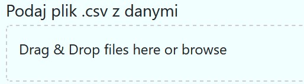
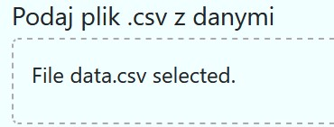
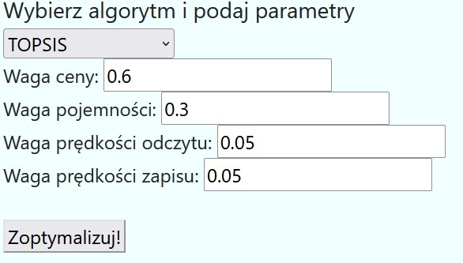
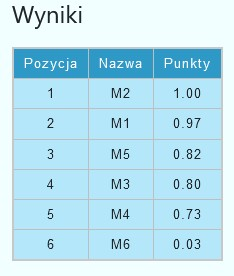

# GUI dla SWD | Analiza działania metod TOPSIS i SP-CS
*Mikołaj Grzybek*

- [GUI dla SWD | Analiza działania metod TOPSIS i SP-CS](#gui-dla-swd--analiza-działania-metod-topsis-i-sp-cs)
  - [Aplikacja GUI ](#aplikacja-gui-)
    - [Budowa](#budowa)
    - [Sposób użycia](#sposób-użycia)
    - [Znane problemy i ograniczenia aplikacji](#znane-problemy-i-ograniczenia-aplikacji)
  - [Zbiór danych](#zbiór-danych)
  - [Wyniki działania zaimplementowanych algorytmów](#wyniki-działania-zaimplementowanych-algorytmów)
    - [Algorytm TOPSIS](#algorytm-topsis)
    - [Algorytm SP-CS](#algorytm-sp-cs)


## Aplikacja GUI <a name="sekcja-1"></a>

### Budowa
GUI zostało zaimplementowane w formie aplikacji webowej, gdzie część aplikacji działająca po stronie przeglądarki została napisana w "czystym" JavaScript i HTML.

Backend został oparty o framework FastAPI w języku python. Pozwala to na łatwe dodawanie nowych algorytmów i funkcjonalności, których implementacja w języku python jest o wiele łatwiejsza niż w przypadku JavaScript. Dzięki tej decyzji projektowej uniknięto korzystania z dużych i zawiłych frameworków JavaScript. 

Można to było również zaimplementować w 100% w JS tak aby wszystko działało lokalnie w przeglądarce lecz wolałem uniknąć zbyt dużej ilości kodu w tym języku na rzecz znanego mi dobrze Pythona.

Kod aplikacji jest dostępny na moim repozytorium GitHub: [GrzybekMikolaj/DecisionSupportSystem](https://github.com/GrzybekMikolaj/DecisionSupportSystem)

Aplikacja została również uruchomiona i dostępna z internetu pod adresem: [DecisionSupportSystem Koyeb.app](https://decisionsupportsystem-grzybek-private.koyeb.app/)

Aplikację można również uruchomić lokalnie, jedynym wymaganiem jest python w wersji 3.10 lub wyżej
W folderze z kodem należy wykonać następujące komendy:
``` powershell
# Należy zainstalować FastAPI
pip install -r ".\requirements.txt"

# Uruchomić serwer
uvicorn main:app --reload

# Serwer będzie dostępny z przeglądarki pod adresem 
127.0.0.1:8000
```

### Sposób użycia
Aplikacja jest bardzo prosta w obsłudze. Najpierw wnleży załadować plik z danymi poprzez przeciągniecię go we wskazane pole lub kliknięcie w nie i wybranie z systemowego menadżera plików. (Rys. 1)


<br> *Rys.1 Pole do wrzucenia pliku*


<br> *Rys.1.2 Pomyślnie załadowany plik*

Następnym krokiem jest wybranie algorytmu z listy rozwijanej. Po wybraniu żądanego algorytmu wyświetlą się możliwe do wprowadzenia parametry. Zestaw parametrów zostanie wyświetlony automatycznie na podstawie wprowadzonych do systemu danych. Przy innych zestawach danych niż ten dołączony systemem mogą wystąpić pewne problemy po stronie serwera. Usprawnienie tego jest przedmiotem dalszych prac nad GUI. (Rys. 2)


<br> *Rys.2 Wybrany algorytm z uzupełnionymi parametrami.*

Po uzupełnieniu wszystkich informacji użytkownik powinien przycisnąć przycisk  "Optymalizuj". Strona automatycznie przewinie się w dół, a na środku ekranu zostanie wyświetlona tabela z wynikami działa algorytmu (Rys.3)


<br> *Rys.3 Tabela z wynikami działania algorytmu*

### Znane problemy i ograniczenia aplikacji
Aplikacja ma problemy z resetowaniem cache-u na przeglądarce Firefox. Inne przeglądarki oparte o Chromium nie mają tego problemu, strona zachowa się tak samo po "odświeżeniu" jak i po ponownym wejściu z nowej karty.

Aplikacja nie nadpisuje już wpisanych parametrów algorytmu. W celu ponownego obliczenia wyników z np. innymi wagami należy odświeżyć stronę. 


## Zbiór danych
Analizie zostały podjęte zewnętrzne dyski. Na potrzeby wyboru najlepszego, 
spisano parametry sześciu różnych dysków, takie jak cena, pojemność, prędkość odczytu i zapisu. 

Parametry, które algorytm będzie brał pod uwagę to cena, pojemność dysku oraz prędkość zapisu i odczytudanych.
Zbiór został dołączony do zadania w postaci pliku .csv gotowego do podania aplikacji


id | marka |  cena  | pojemnosc  | prędkosc-odczytu | predkosc-zapisu
---- | ---- | ---- | ---- | ---- | ---- |
M1 | lexar-sl200 | 300 | 1000   | 550 |      400
M2 |  adata-elitr-se880 |   300 |     1000 |        2000 |      2000
M3 |  samsungh-t7 | 405 |  1000   |   1050 |       1000
M4 | samsung-t7 |   420 |  1000 | 1050 |             1000
M5 | sandisk-extreme | 400 |  1000 | 1050 |            1000
M6 |  sandisk-extreme-pro |     625 |     1000 |        2000 | 2000


## Wyniki działania zaimplementowanych algorytmów
Przyjęto poniższe wagi

Cena  | Pojemność  | Prędkość Odczytu | Prędkość Zapisu
| ---- | ---- | ---- | ---- |
0.6 | 0.3 | 0.05 | 0.05


### Algorytm TOPSIS

Wynikiem działania tego algorytmu przedstawiono poniżej:

Pozycja | Nazwa | Wynik 
---- | ---- | ----
1 | M2 | 1.0 
2 | M1 | 0.9719
3 | M5 | 0.8194 
4 | M3 | 0.7990 
5 | M4 | 0.7305
6 | M6 | 0.0280

### Algorytm SP-CS

Wynikiem działania tego algorytmu przedstawiono poniżej:

Pozycja | Nazwa | Wynik 
---- |-------| ----
1 | M1    | 5.15
2 | M4    | 139.18
3 | M6    | 381.24 

Punkty M2, M3 i M5 zostały uznane jako zdominowane.
---- |-------| ----
4 | M3    | 0.7990 
5 | M4    | 0.7305
6 | M6    | 0.0280

{'M1': array([[5.15052476]]), 'M4': array([[139.17799112]]), 'M6': array([[381.23995886]])}


## Implementacja algorytmów

### TOPSIS

```python
import enum
import math
from file_handler import read_json
from parser import parse_weights2dict


def topsisMethod(data):
    algo_settings, alternatives = parse_weights2dict(data)

    normalized_data = normalize_data(alternatives)

    weighted_normalized_matrix = calculate_weighted_normalized_matrix(normalized_data, algo_settings)

    ideal_positive, ideal_negative = calculate_ideal_solutions(weighted_normalized_matrix)

    separation_measures = calculate_separation_measures(weighted_normalized_matrix, ideal_positive, ideal_negative)

    rankings = rank_alternatives(separation_measures)

    return rankings

def normalize_data(alternatives):
    normalized_data = {}

    for criterion in alternatives["M1"]:
        temp_sum = 0
        if all(criterion in alternative for alternative in alternatives.values()):
            for alternative in alternatives.values():
                temp_sum += pow(alternative[criterion], 2)
            sqrt_of_pow = math.sqrt(temp_sum)

            for key in alternatives:
                if criterion not in normalized_data:
                    normalized_data[criterion] = {}
                if criterion in alternatives[key]:
                    if criterion == "cena":
                        normalized_data[criterion][key] = alternatives[key][criterion] / sqrt_of_pow
                    else:
                        normalized_data[criterion][key] = 1 - alternatives[key][criterion] / sqrt_of_pow
    return normalized_data


def calculate_weighted_normalized_matrix(normalized_data, weights):
    weighted_normalized_matrix = {}

    for key in normalized_data:
        if key not in weighted_normalized_matrix:
            weighted_normalized_matrix[key] = {}
        for alternative in normalized_data[key]:
            weighted_normalized_matrix[key][alternative] = normalized_data[key][alternative] * weights[key]

    return weighted_normalized_matrix

def calculate_ideal_solutions(weighted_normalized_matrix):
    ideal_positive = {}
    ideal_negative = {}

    for key in weighted_normalized_matrix:
        ideal_positive[key] = max(weighted_normalized_matrix[key].values())
        ideal_negative[key] = min(weighted_normalized_matrix[key].values())

    return ideal_positive, ideal_negative

def calculate_separation_measures(weighted_normalized_matrix, ideal_positive, ideal_negative):
    separation_measures = {}

    for alternative in weighted_normalized_matrix[list(weighted_normalized_matrix.keys())[0]]:
        positive_distance = sum((weighted_normalized_matrix[key][alternative] - ideal_negative[key]) ** 2 for key in weighted_normalized_matrix)
        negative_distance = sum((weighted_normalized_matrix[key][alternative] - ideal_positive[key]) ** 2 for key in weighted_normalized_matrix)

        separation_measures[alternative] = negative_distance / (positive_distance + negative_distance)

    return separation_measures


def rank_alternatives(separation_measures):
    rankings = sorted(separation_measures.items(), key=lambda x: x[1], reverse=True)
    rankings = map(lambda x: {x[0]: x[1]}, rankings)
    rankings = enumerate(rankings)
    rankings = dict(rankings)
    return rankings


def main():
    file_path_new = 'static/data20rand.json'
    data_new = read_json(file_path_new)
    result = topsisMethod(data_new)

    print("Rankings:")
    print(result)
    for rank, score in result:
        rounded_score = round(score, 3)
        print(f"{rank}: {rounded_score}")

if __name__ == "__main__":
    main()
    
```

### Safety Principal Compromise Selection


```python
import numpy as np
import matplotlib.pyplot as plt
from file_handler import read_json
from parser import parse_weights2dict
from scipy.spatial.distance import cdist


def spcs_method(data):
    #  Parse algorithm settings and alternatives from input data
    algo_settings, alternatives = parse_weights2dict(data)

    aspiration_points = algo_settings[0]
    # norm_aspiration_points = normalize_points(aspiration_points)

    reference_points = algo_settings[1]
    # norm_reference_points = normalize_points(reference_points)

    # Step 1 - Delete dominated points
    minimize_criteria = {'cena': True, 'pojemnosc': False, 'predkosc_odczytu': False, 'predkosc_zapisu': False}
    dominance_filtered_alternatives = remove_dominated_points(alternatives, minimize=minimize_criteria)

    # Step 2 - Consider noise in input data
    perturbation_range = 0  # sample noise value,
    noisy_dominated_alternatives = add_perturbation(dominance_filtered_alternatives, perturbation_range)

    # Step 3 - Calculate Skeleton Curve and plot all points and curves
    skeleton_curve = construct_skeleton_curve(reference_points, aspiration_points)

    # Step 4 - Find projection of non-dominated alternatives set on the skeleton curves
    projected_points = find_projection(noisy_dominated_alternatives, skeleton_curve)

    # Step 5 - Find compromise point and value of scoring function for all non-dominated alternatives
    score, compromise_point = scoring_function(projected_points, skeleton_curve, noisy_dominated_alternatives)

    comp_point_x = noisy_dominated_alternatives[compromise_point]['cena']
    comp_point_y = noisy_dominated_alternatives[compromise_point]['pojemnosc']
    compromise_point_cords = [comp_point_x, comp_point_y]

    # Step 6 - Plot all points and skeleton curves
    plot_curves_and_points(alternatives, noisy_dominated_alternatives, reference_points, aspiration_points,
                           skeleton_curve, compromise_point_cords)


def remove_dominated_points(alternatives, minimize=None):
    if len(alternatives) == 0:
        return alternatives

    if minimize is None:
        minimize = {key: True for key in next(iter(alternatives.values()))}

    dominated = {key: False for key in alternatives}
    for key_i, point_i in alternatives.items():
        for key_j, point_j in alternatives.items():
            if key_i != key_j:
                dominates_i = all(
                    (point_i[key] <= point_j[key] if minimize[key] else point_i[key] >= point_j[key])
                    for key in point_i
                )
                dominates_j = all(
                    (point_j[key] <= point_i[key] if minimize[key] else point_j[key] >= point_i[key])
                    for key in point_j
                )

                if dominates_i and not dominates_j:
                    dominated[key_i] = True
                    break

    return {key: point for key, point in alternatives.items() if not dominated[key]}


def add_perturbation(alternatives, perturbation_range):
    perturbed_alternatives = {}
    for key, point in alternatives.items():
        perturbation = {param: np.random.uniform(low=-perturbation_range, high=perturbation_range) for param in point}
        perturbed_alternatives[key] = {param: value + perturbation[param] for param, value in point.items()}
    return perturbed_alternatives


def construct_skeleton_curve(reference_points, aspiration_points):
    skeleton_curve = {}

    # Perform linear interpolation
    t = np.linspace(0, 1, 100)
    aspiration_x, aspiration_y = aspiration_points['cena-asp'], aspiration_points['pojemnosc-asp']
    reference_x, reference_y = reference_points['cena-ref'], reference_points['pojemnosc-ref']

    interp_x = np.interp(t, [0, 1], [aspiration_x, reference_x])
    interp_y = np.interp(t, [0, 1], [aspiration_y, reference_y])

    skeleton_curve[0] = {'interp_x': interp_x, 'interp_y': interp_y}

    return skeleton_curve


def plot_curves_and_points(alternatives, non_dominated_alternatives, reference_points, aspiration_points,
                           skeleton_curve, compromise_point):
    plt.figure(figsize=(8, 6))

    # Plot alternatives
    for key, value in alternatives.items():
        x = value['cena']
        y = value['pojemnosc']
        plt.scatter(x, y, label=f'Alternative {key}', alpha=0.7,  color='grey')

    # Plot non dominated alternatives
    for key, value in non_dominated_alternatives.items():
        x = value['cena']
        y = value['pojemnosc']
        plt.scatter(x, y, label=f'Non-Dominated Alternative {key}', marker='x', color='red', alpha=0.7)

    # Plot reference points
    x = reference_points['cena-ref']
    y = reference_points['pojemnosc-ref']
    plt.scatter(x, y, label=f'Reference Point', marker='s', color='green', s=100)

    # Plot aspiration points
    x = aspiration_points['cena-asp']
    y = aspiration_points['pojemnosc-asp']
    plt.scatter(x, y, label=f'Aspiration Point', marker='^', color='blue', s=100)

    # Plot skeleton curves
    for i, curve_data in skeleton_curve.items():
        plt.plot(curve_data['interp_x'], curve_data['interp_y'], linestyle='--', label=f'Skeleton Curve', alpha=0.5)

    # Plot compromise point
    plt.scatter(compromise_point[0], compromise_point[1], label=f'Compromise Point', marker='^', color='red', s=100)

    plt.legend()
    plt.grid()
    plt.xlabel('Price')
    plt.ylabel('Space')
    plt.title('Skeleton Curves Diagram')
    plt.show()


def normalize_points(points):
    max_value = max(points.values())
    min_value = min(points.values())

    norm_points = {key: (value - min_value) / (max_value - min_value) for key, value in points.items()}

    return norm_points


def chebyshev_distance(x1, y1, x2, y2):
    return max(abs(x1 - x2), abs(y1 - y2))


def find_projection(noisy_dominated_alternatives, skeleton_curve):
    projected_points = {}

    for key, curve_data in skeleton_curve.items():
        skeleton_x = curve_data['interp_x']
        skeleton_y = curve_data['interp_y']

        for alt_key, alt_value in noisy_dominated_alternatives.items():
            alt_x = alt_value['cena']
            alt_y = alt_value['pojemnosc']

            # Find the projection of the alternative onto the skeleton curve
            projection = np.argmin(
                [chebyshev_distance(alt_x, alt_y, skeleton_x[i], skeleton_y[i]) for i in range(len(skeleton_x))])

            # Calculate the coordinates of the projected point
            projected_x = skeleton_x[projection]
            projected_y = skeleton_y[projection]

            # Store the projected point
            projected_points[alt_key] = {'projected_x': projected_x, 'projected_y': projected_y}

    return projected_points


def scoring_function(projected_points, skeleton_curve, non_dominated_points):
    distances = {}
    for key, proj_data in projected_points.items():
        proj_x = proj_data['projected_x']
        proj_y = proj_data['projected_y']

        alt_x = non_dominated_points[key]['cena']
        alt_y = non_dominated_points[key]['pojemnosc']
        # Calculate distance from alternative to the projected point on the curve
        distances[key] = cdist(np.array([[proj_x, proj_y]]), np.array([[alt_x, alt_y]]))

    # Znalezienie punktu kompromisowego (minimalnej wartości funkcji skoringowej)
    min_key = min(distances, key=lambda k: distances[k])
    compromise_point = min_key

    return distances, compromise_point


def main():
    file_path_new = 'static/data20rand.json'
    data = read_json(file_path_new)

    spcs_method(data)


if __name__ == "__main__":
    main()

```